# Programmieren mit Java [#8]: (Einstieger | Online)



Die Kapitel sind so organisiert, dass ihr einen groben ueberblick bekommt.

## Projektstruktur

Die Ordnerstruktur sieht so aus:

```bash
java_8_einsteiger_online
|____Notizen
|____wichtigeDinge
|____Hausaufgaben
|____src
|    |____live_coding
|    |    |____kapitel1_grundlagen
|    |    |    |____HelloWorld_1.java
|    |    |    |____Variablen_2.java
|    |    |    |____Literale_3.java
|    |    |    |____...
|    |    |
|    |    |____kapitel2_flusskontrolle
|    |    |    |____IfElse_Anweisung_1.java
|    |    |    |____Switch_Anweisung_2.java
|    |    |    |____ForSchleife_3.java
|    |    |    |____...
|    |    |____...
|    |
|    |____resources
|    |    |____kapitel1_grundlagen
|    |    |    |____HelloWorld_1.java
|    |    |    |____Variablen_2.java
|    |    |    |____Literale_3.java
|    |    |    |____...
|    |    |
|    |    |____kapitel2_flusskontrolle
|    |    |    |____IfElse_Anweisung_1.java
|    |    |    |____Switch_Anweisung_2.java
|    |    |    |____ForSchleife_3.java
|    |    |    |____...
|    |    |____...
```

Dabei enthält jedes Kapitel (z.B., `kapitel1`, `kapitel2`, usw.) einzelne Java-Dateien (`HelloWorld.java`, `Variablen.java`, usw.)


# KursInhaltsübersicht

# A. Imperative Programmierung 

## Java Grundlagen (Kapitel 1)
01. Java Syntax
02. Kommentare
03. Variablen
04. Literale (Werte)
05. Datntypen
06. Operatoren
07. Casting

## Java Flusskontrolle (Kapitel 2)
08. If-else statements
09. switch Anweisung
10. for Schleife
11. while Schleife
12. break, continue

## Java Weiterführende Themen (Kapitel 3)
13. Zeichenketten
14. Arrays
15. Methoden
16. Input & Output
17. Random Klasse
18. Error Handling (try, catch throw)

# B. Objekt-Orientierte Programmierung (OOP) 

## Java Klassen & Objekte (Kapitel 4)
19. Syntax
20. static Modifikator
21. Klassen/Instanz
       Variablen
22. Klassen/Instanz 
       Methoden
23. Konstruktoren

# Weitere Infos

Schaut auf unserer [Website](https://www.mathcodelab.de/laufende_kurse/informatik_kurse/uni/java8/java_8_generell.html) vorbei für zusätzliche Informationen und Infos zum Kurs.

# Telegram-Gruppe

Tretet unserer [Telegram-Gruppe](https://t.me/mathcodelab/2301) bei, um euch mit anderen Studis auszutauschen.

Viel Spaß beim Programmieren!
